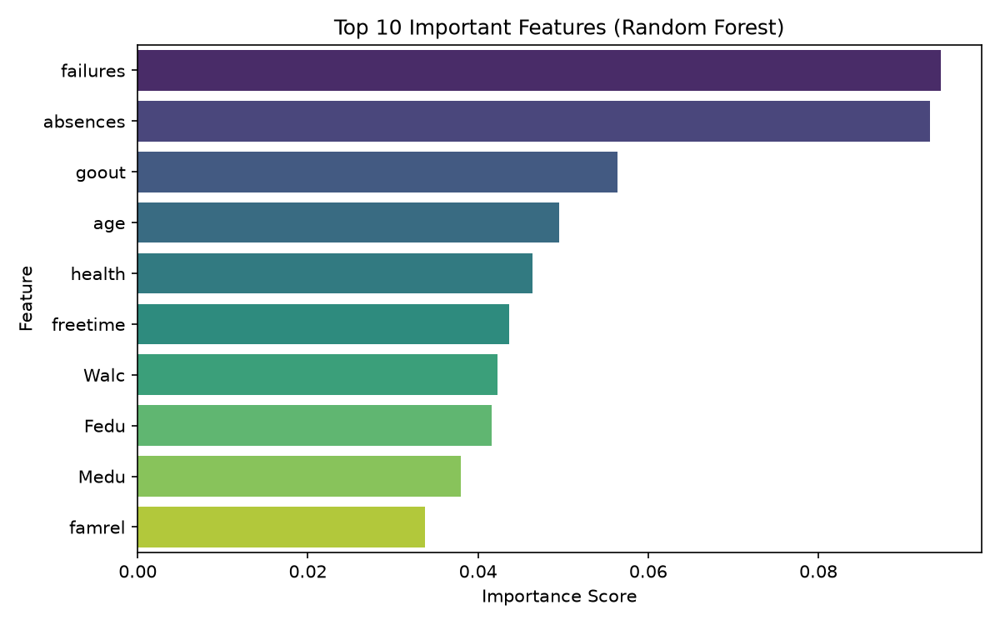
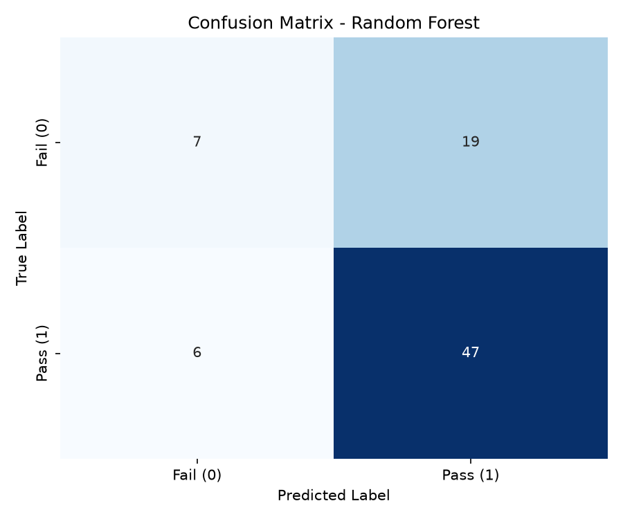
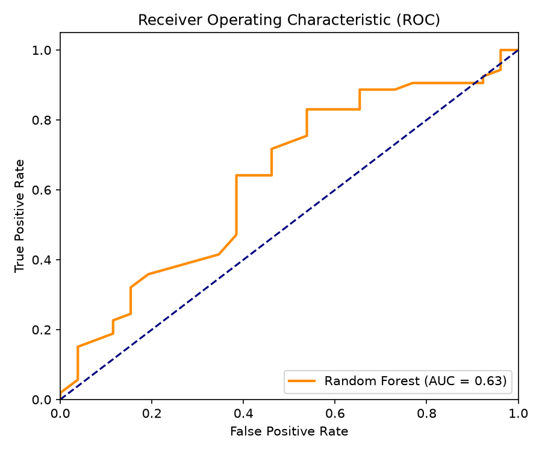
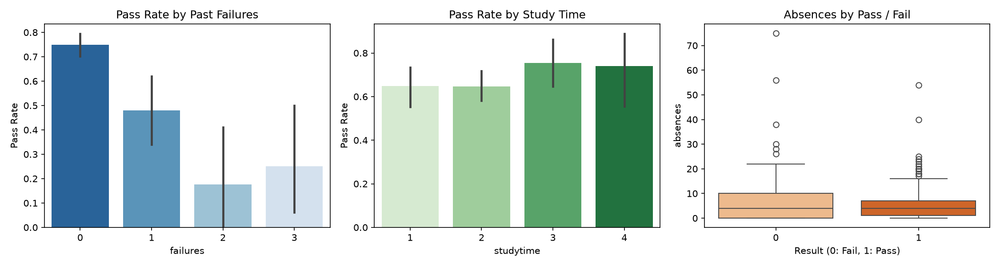
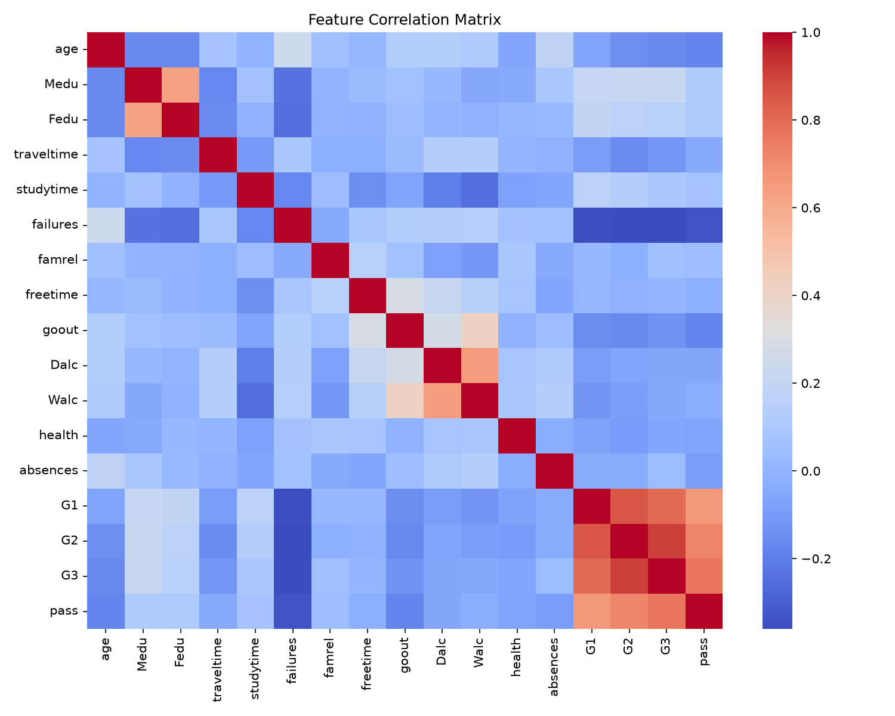

# Student Performance Data Mining

> 🌐 **Live Web Demo**: [https://xuanbackhoaibu.github.io/student_performance/](https://xuanbackhoaibu.github.io/student_performance/)

Bài tập lớn môn Khai phá dữ liệu, sử dụng bộ dữ liệu Student Performance của UCI để phân tích hành vi học tập và xây dựng mô hình dự đoán học sinh đậu/rớt.

## Mục tiêu

- Phân tích dữ liệu học sinh bằng EDA
- Xử lý dữ liệu, encoding, scaling và chia train/test
- Khai phá luật kết hợp bằng Apriori
- Phân cụm học sinh bằng KMeans
- Huấn luyện mô hình phân loại dự đoán `pass`
- Thử nghiệm học bán giám sát bằng LabelPropagation
- Đánh giá mô hình bằng Accuracy, Precision, Recall, F1-score, Confusion Matrix và ROC-AUC

## Công nghệ sử dụng

- Python
- pandas, numpy
- matplotlib, seaborn
- scikit-learn
- mlxtend
- PyYAML
- Jupyter Notebook

## Dataset

- Nguồn: UCI Machine Learning Repository
- Bộ dữ liệu: Student Performance
- File dữ liệu trong repo:
  - `data/raw/student-mat.csv`
  - `data/raw/student-por.csv`
  - `data/raw/student.txt`

Biến mục tiêu `pass` được tạo từ điểm cuối kỳ `G3`:

```text
pass = 1 nếu G3 >= 10
pass = 0 nếu G3 < 10
```

Các biến `G1`, `G2`, `G3` được loại khỏi tập huấn luyện để tránh data leakage.

## Chức năng / nội dung đã làm

- `01_eda.ipynb`: phân tích dữ liệu, phân phối điểm, missing/duplicate, insight ban đầu
- `02_preprocessing.ipynb`: làm sạch dữ liệu, encoding biến categorical, scaling, stratified split
- `03_pattern_mining.ipynb`: Apriori và association rules
- `04_clustering.ipynb`: KMeans, Elbow Method, Silhouette Score
- `05_classification.ipynb`: Logistic Regression, Decision Tree, Random Forest
- `06_semi_supervised.ipynb`: LabelPropagation với nhiều tỷ lệ thiếu nhãn
- `07_evaluation.ipynb`: tổng hợp kết quả, confusion matrix, ROC-AUC, phân tích lỗi

## Cấu trúc thư mục

```text
configs/
  params.yaml              cấu hình đường dẫn, seed, model
data/
  raw/                     dữ liệu gốc
notebooks/
  01_eda.ipynb
  02_preprocessing.ipynb
  03_pattern_mining.ipynb
  04_clustering.ipynb
  05_classification.ipynb
  06_semi_supervised.ipynb
  07_evaluation.ipynb
src/
  data/                    load/clean dữ liệu
  features/                tạo đặc trưng
  mining/                  Apriori, clustering
  models/                  supervised, semi-supervised
  evaluation/              metrics/report
  visualization/           biểu đồ
scripts/
  run_pipeline.py          file pipeline tổng hợp
```

## Cách chạy project

Tạo môi trường ảo:

```bash
python -m venv .venv
source .venv/bin/activate
```

Cài thư viện:

```bash
pip install -r src/requirements.txt
```

Mở notebook:

```bash
jupyter notebook
```

Chạy lần lượt các notebook trong thư mục `notebooks/` từ `01_eda.ipynb` đến `07_evaluation.ipynb`.

Hoặc chạy toàn bộ pipeline tự động qua dòng lệnh (CLI):

```bash
python scripts/run_pipeline.py
```

Khởi chạy ứng dụng Web Dashboard tương tác (Streamlit):

```bash
streamlit run app.py
```

## Ảnh demo / kết quả

### 1. Top 10 đặc trưng quan trọng nhất (Random Forest)


### 2. Ma trận nhầm lẫn (Confusion Matrix) & ROC Curve
<p align="center">
  
  
</p>

### 3. Phân tích các yếu tố cốt lõi & Tương quan



## Insight chính

- Số lần trượt trước đó (`failures`) là tín hiệu quan trọng liên quan đến nguy cơ rớt
- Nghỉ học nhiều (`absences`) có thể ảnh hưởng tiêu cực đến kết quả
- Thời gian học (`studytime`) và bối cảnh gia đình/xã hội có liên quan đến hiệu suất học tập
- Có thể phát triển thành hệ thống cảnh báo sớm cho học sinh có nguy cơ học yếu

## Điểm nổi bật khi trao đổi với nhà tuyển dụng

- Có quy trình data mining tương đối đầy đủ: EDA, preprocessing, association rules, clustering, classification, evaluation
- Có ý thức tránh data leakage khi loại `G1`, `G2`, `G3` khỏi tập huấn luyện
- Biết so sánh nhiều mô hình và đọc kết quả bằng metric phù hợp
- Có thể trình bày insight dữ liệu theo hướng ứng dụng thực tế trong giáo dục

## Bản demo trực tuyến

Website tương tác trực tuyến được triển khai tại GitHub Pages:
👉 **[https://xuanbackhoaibu.github.io/student_performance/](https://xuanbackhoaibu.github.io/student_performance/)**

## Tác giả

Trần Xuân Bắc

GitHub: https://github.com/xuanbackhoaibu
